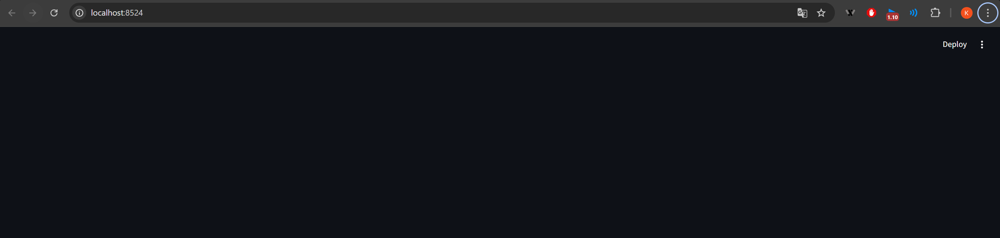
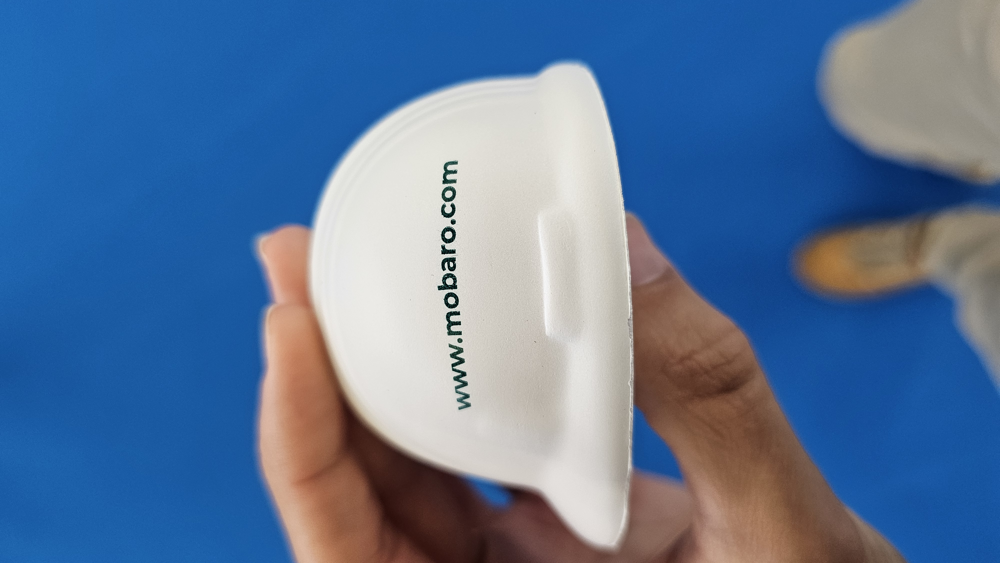
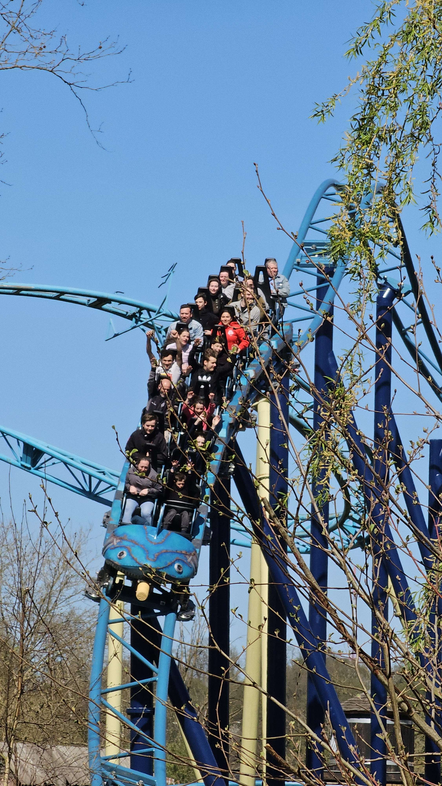
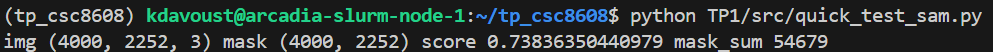
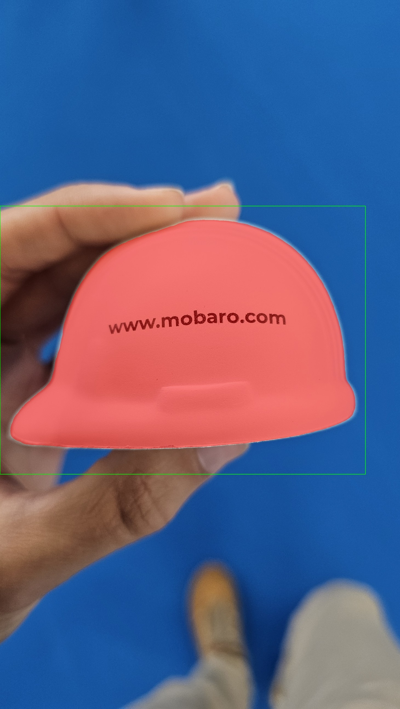
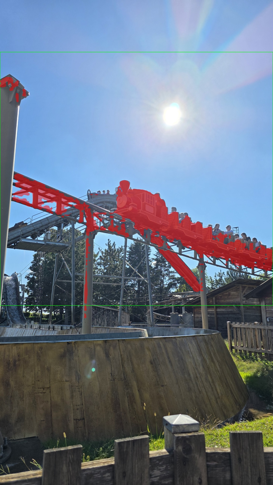
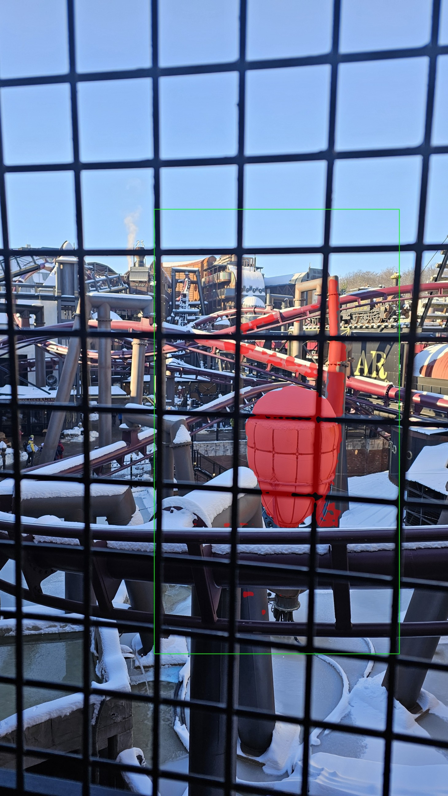
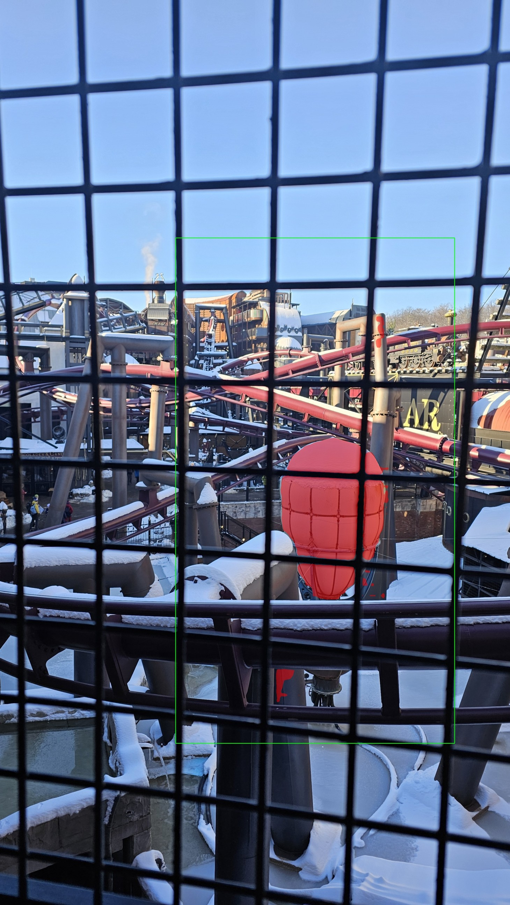

Question 1.c. Mettez à jour votre rapport TP1/report/report.md avec :
- le lien de votre dépôt (ou un placeholder que vous remplacerez plus tard),

Lien dépot GITHUB : https://github.com/AquaKilll/tp_csc8608

- l’endroit où vous exécutez le TP (local ou nœud GPU via SLURM),

Environnement : Nœud GPU via SLURM

- l’arborescence TP1/ (un simple aperçu, pas besoin de copier toutes les commandes).

TP1/
├── data/
│   └── images/          # Images sources pour la segmentation
├── outputs/             # Résultats générés (non versionnés)
│   ├── logs/
│   └── overlays/
├── report/              # Documentation du TP
├── src/                 # Code source
│   ├── app.py           # Application principale (Gradio/Streamlit)
│   ├── geom_utils.py    # Calculs métriques (aires, périmètres)
│   ├── sam_utils.py     # Wrapper pour le modèle SAM
│   └── viz_utils.py     # Outils de visualisation
└── requirements.txt

Question 1.e. Mettez à jour votre rapport avec :
- le nom de l’environnement conda activé,

tp_csc8608

- une preuve que CUDA est disponible (ex : capture terminal ou une phrase avec les valeurs clés).

(tp_csc8608) kdavoust@arcadia-slurm-node-1:~/tp_csc8608$ python -c "import torch; print(f'Torch: {torch.__version__}'); print(f'CUDA: {torch.cuda.is_available()}'); print(f'GPU: {torch.cuda.get_device_name(0)}')"
Torch: 2.7.1+cu118
CUDA: True
GPU: NVIDIA H100 NVL MIG 1g.12gb

Question 1.g.  Mettez à jour votre rapport avec :
- une preuve que l’import de segment_anything fonctionne (capture terminal ou phrase courte).

(tp_csc8608) kdavoust@arcadia-slurm-node-1:~/tp_csc8608$ python -c "import streamlit, cv2, numpy; print('ok'); import segment_anything; print('sam_ok')"
ok
sam_ok

Question 1.i Mettez à jour votre rapport avec :
- le port choisi,

8524

- une capture d’écran montrant Streamlit ouvert dans le navigateur (URL visible),

- un court commentaire : “UI accessible via SSH tunnel : oui/non”.

UI accessible via SSH tunnel : OUI

**EXERCICE 2 : Constituer un mini-dataset (jusqu’à 20 images)**

Mettez à jour votre rapport avec :
- le nombre d’images final,

10

- une liste de 5 images représentatives (nom de fichier + 1 phrase sur pourquoi elle est intéressante),

- casque_simple2 : un casque blanc sur fond bleu
- f1_charge4 : voiture f1 avec des objets devant et sur les côtés
- roue_simple3 : roue de coaster sur fond rouge
- train_charge1 : une modélisation de train avec des personnes autour
- traindive_simple1 : un train entrain de drop sur fond blanc

- au moins 2 captures d’écran (ou vignettes) montrant un cas simple et un cas difficile.

Cas facile

Cas difficle

**EXERCICE 3 : Charger SAM (GPU) et préparer une inférence “bounding box → masque”**

Question 3.e. Mettez à jour votre rapport avec :
- le modèle choisi (vit_h par exemple) et le nom du checkpoint utilisé (sans l’ajouter au dépôt),

Modèle : ViT-H (Huge) Checkpoint utilisé : sam_vit_h_4b8939.pth Périphérique : CUDA (GPU) détecté et utilisé.

- une capture du test rapide (sortie console) montrant la shape de l’image, du masque, et le score,

- un court commentaire (3–5 lignes) sur un premier constat : “ça marche / c’est lent / limites observées”.

Le test valide le fonctionnement technique (masque généré avec un score de 0.74), mais la latence est critique (~20 secondes). Cette lenteur s'explique par le "cold start" (chargement du modèle ViT-H) et surtout la très haute résolution de l'image ($4000 \times 2252$) qui alourdit considérablement l'étape d'encodage (embedding). Pour une application interactive fluide, il sera indispensable de redimensionner les images (downsampling) avant l'inférence.

**EXERCICE 4 : Mesures et visualisation : overlay + métriques (aire, bbox, périmètre)**

Question 4.d. Mettez à jour votre rapport avec :
- une capture d’écran (ou vignette) d’un overlay produit,

TP1/outputs/overlays/overlay_epcot_simple3.png

- un mini-tableau (3 lignes) récapitulant image → score → aire → périmètre pour 3 images,

| Image               | Score SAM | Aire (px) | Périmètre (px) |
| ------------------- | --------- | --------- | -------------- |
| tableau_simple1.jpg | 1.000     | 4308407   | 9714.8         |
| casque_simple2.jpg  | 0.990     | 1842931   | 5603.6         |
| roue_simple3.jpg    | 1.00      | 1751507   | 5972.3         |

- un commentaire bref (5–8 lignes) : dans quels cas l’overlay aide à “debugger” le modèle/prompt ?

L'overlay est indispensable car le score de confiance (IoU) seul est trompeur. Sur l'exemple ci-dessus, SAM affiche un score correct de 0.738, mais l'overlay révèle que le modèle a segmenté une zone de ciel (nuage) correspondant à la bbox par défaut, au lieu de l'objet d'intérêt (le train). La visualisation permet de valider immédiatement trois points critiques : le positionnement correct de la bounding box d'entrée (ici mal placée en haut à gauche), la cohérence des contours (bords flous ou nets), et la présence d'artefacts (petits îlots de pixels isolés) invisibles dans les simples métriques d'aire.

**EXERCICE 5 : Mini-UI Streamlit : sélection d’image, saisie de bbox, segmentation, affichage et sauvegarde**

Question 5.d. Mettez à jour votre rapport avec :
- 2–3 captures d’écran de l’UI montrant des résultats (un cas simple et un cas difficile),

Cas simple :

Cas Chargé :

Cas difficle :

- un tableau (ou liste) de 3 tests : image + bbox (valeurs) + score + aire + temps ms,

| Image              | Bbox du masque (x1, y1, x2, y2) | Score SAM | Aire (px) | Périmètre (px) | Temps (ms) |
| ------------------ | ------------------------------- | --------- | --------- | -------------- | ---------- |
| casque_simple2.jpg | [58, 1240, 2000, 2531]          | 1.011     | 1844451   | 5598.8         | 1758.7     |
| walt_charge3.jpg   | [398, 1858, 1966, 3999]         | 0.858     | 937788    | 11822.9        | 1750.5     |
| ball_diff1.jpg     | [1235, 1934, 1703, 2650]        | 0.962     | 213762    | 4189.1         | 1727.7     |

- un court paragraphe “debug” : qu’est-ce qui change quand vous agrandissez/rétrécissez la bbox ?

L'ajustement de la bounding box impacte directement le comportement du modèle. Agrandir excessivement la zone introduit de l'ambiguïté : SAM risque d'inclure des éléments du contexte (ombres, objets adjacents) ou de changer d'échelle (segmenter tout le décor au lieu de l'objet), ce qui fait souvent baisser légèrement le score de confiance. À l'inverse, rétrécir trop la boîte au point de couper l'objet force le modèle à traiter une information tronquée ; cela entraîne souvent un masque incomplet et une chute du score IoU, car le modèle peine à générer une forme cohérente lorsqu'une partie essentielle de l'objet est exclue de l'entrée.

**EXERCICE 6 : Affiner la sélection de l'objet : points FG/BG + choix du masque (multimask)**

Question 6.j. Testez sur au moins 2 images difficiles où la bbox contient plusieurs éléments (ou un fond complexe). Pour chaque image, faites :
- un essai “bbox seule” (sans points) ; notez si le masque correspond à l’objet voulu,
- un essai “bbox + 1 point FG” (sur l’objet voulu),
- si nécessaire, ajoutez 1 point BG sur une zone à exclure (fond ou autre objet),
- comparez les masques candidats (multimask) et choisissez le meilleur via l’UI.

Question 6.k. Mettez à jour votre rapport avec :
- une comparaison “avant/après” sur 2 images (captures UI) : bbox seule vs bbox + points,
- pour chaque cas : la liste des points utilisés (coordonnées + FG/BG) et le masque index choisi,

trainsoleil_diff3 sans points (masque 2 / index : 0.788) :

trainsoleil_diff3 avec points (masque 1 / index : 0.840) :

ballon_diff1 sans points (masque 2 / index : 0.683) :

ballon_diff1 avec points (masque 1 : index : 0.828) :
- 3 points BG [1687 1765 / 1530 1855 / 1246 2386]
- 1 point FG [1517 1765]

- un court paragraphe (6–10 lignes) : dans quels cas les points BG sont indispensables ? quels cas restent difficiles ?

Les points BG sont indispensables lorsque la bounding box seule est ambiguë, notamment quand l'objet cible est accolé à un élément similaire ou projette une ombre forte que SAM inclut par erreur. Ils agissent comme une contrainte négative pour séparer des objets fusionnés ou évider des formes creuses (ex: l'intérieur d'une poignée). Cependant, la segmentation reste difficile pour les objets transparents (verre), les structures très fines (câbles, grillages) ou les zones à très faible contraste, où les limites visuelles sont floues même pour l'humain, rendant le guidage par points parfois instable.

**EXERCICE 7 : Bilan et réflexion (POC vers produit) + remise finale**

Question 7.a. Dans votre rapport, rédigez une réponse courte (8–12 lignes) à la question suivante : quels sont les 3 principaux facteurs qui font échouer votre segmentation (sur vos images), et quelles actions concrètes (data, UI, pipeline) permettraient d’améliorer la situation ?

Les trois principaux facteurs d'échec observés sont : 
- l'ambiguïté sémantique de la BBox (SAM hésite entre l'objet entier et une sous-partie, ou inclut une ombre portée), 
- le faible contraste (camouflages, environnements sombres) ou la transparence, et 
- les structures fines (câbles, grillages) souvent perdues lors de la compression de l'image par l'encodeur.

Pour améliorer la situation, trois actions concrètes :
- UI/Workflow : Imposer un flux de "raffinement actif" où l'utilisateur est invité à cliquer sur les zones d'erreur si le score IoU est inférieur à un seuil.
- Pipeline : Ajouter un post-traitement morphologique (suppression des petits îlots de pixels isolés) pour nettoyer les masques bruyants.
- Data : Si le domaine d'application est spécifique (ex: industriel), réaliser un fine-tuning (via LoRA) ou utiliser un pré-traitement de rehaussement de contraste (CLAHE) avant l'inférence.

Question 7.b. Dans votre rapport, rédigez une réponse courte (8–12 lignes) à la question suivante : si vous deviez industrialiser cette brique, que loggueriez-vous et que monitoreriez-vous en priorité ? Donnez au minimum 5 éléments.

Pour industrialiser cette brique, je mettrais en place un monitoring sur 5 signaux prioritaires :
- Latence d'inférence (p99) : Pour détecter les goulots d'étranglement (réseau ou surcharge GPU) qui nuisent à l'expérience utilisateur.
- Taux d'acceptation (Save Rate) : Le ratio entre masques générés et masques sauvegardés ; une chute indique une baisse de qualité perçue ou un "data drift".
- Score de confiance moyen (IoU) : Une baisse tendancielle de ce score signale que le modèle reçoit des images trop différentes de son entraînement initial.
- Nombre d'interactions par masque : Si les utilisateurs doivent ajouter 5 points FG/BG en moyenne au lieu de 0, l'UX se dégrade et le modèle n'est plus assez performant.
- Consommation VRAM & Erreurs OOM : Pour dimensionner l'infrastructure et éviter les crashs si des images trop grandes sont envoyées.

Question 7.c. Remise finale :
- Vérifiez que votre dépôt contient bien TP1/ avec le code source et le rapport.
- Vérifiez que vous n’avez pas ajouté de fichiers trop volumineux (notamment les checkpoints SAM).
- Faites un push de votre dépôt et ajoutez un tag TP1 pointant vers la version rendue.
- Envoyez le lien de votre dépôt à l’enseignant.