**EXERCICE 1 : Mise en place & smoke test (GPU + Diffusers)**

Photo généré avec le smoke_test :

**EXERCICE 2 : Factoriser le chargement du pipeline (text2img/img2img) et exposer les paramètres**

Capture de baseline.png :

Config affichée :

CONFIG: {'model_id': 'stable-diffusion-v1-5/stable-diffusion-v1-5', 'scheduler': 'EulerA', 'seed': 42, 'steps': 30, 'guidance': 7.5}

**EXERCICE 3 : Text2Img : 6 expériences contrôlées (paramètres steps, guidance, scheduler)**

Question 3.c. Faites une comparaison qualitative des 6 résultats (sans métrique). Dans votre rapport.md, produisez :

Pour générer les photos j'ai utilisé le prompt suivant : "professional product photography of a futuristic running sneaker, vibrant orange and white, floating, white background, soft studio lighting, highly detailed, 8k, sharp focus"

- une grille de captures (ou 6 captures séparées) montrant les résultats,
- un court commentaire (bullet points) décrivant l’effet de steps, guidance et scheduler.

| Run | Paramètre modifié                  | Image                                |
| --- | ---------------------------------- | ------------------------------------ |
| 01  | Baseline (30 steps, G=7.5, EulerA) | 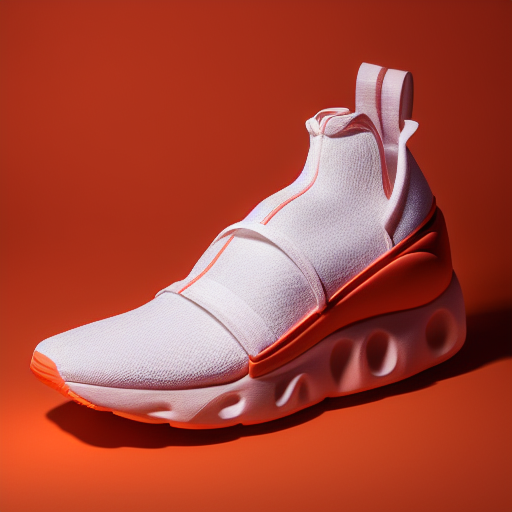  |
| 02  | Steps bas (15 steps)               | 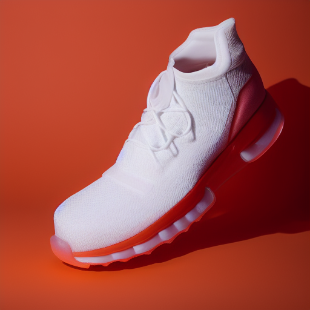   |
| 03  | Steps haut (50 steps)              | 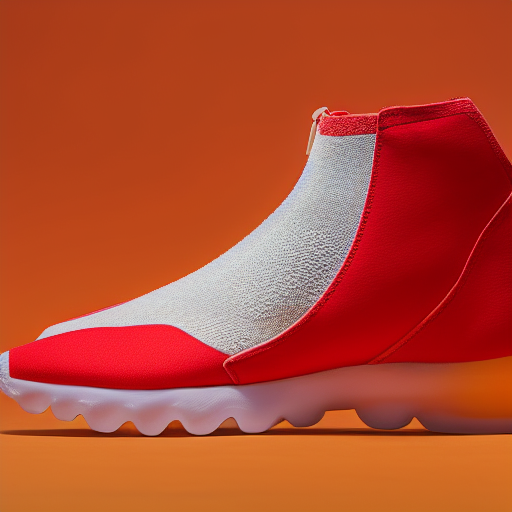 |
| 04  | Guidance bas (4.0)                 | 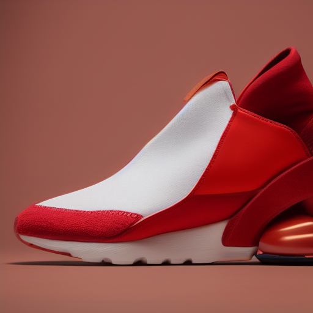     |
| 05  | Guidance haut (12.0)               | 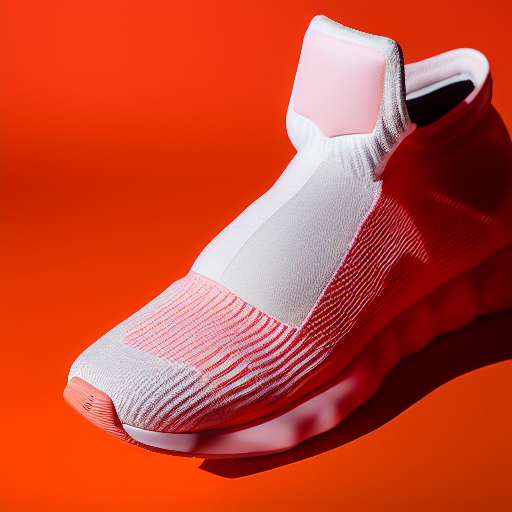    |
| 06  | Scheduler DDIM (30 steps, G=7.5)   |       |

Impact steps :
- Faible (15 steps) : L'image est globalement cohérente mais manque de finition dans les détails fins. La structure globale est bonne car EulerA converge vite.
- Élevé (50 steps) : Les textures sont plus précises, mais la différence avec 30 steps (baseline) est minime. Au-delà d'un certain seuil, ajouter des steps coûte du temps de calcul pour un gain visuel marginal.

Impact guidance :
- Faible (4.0) : Le modèle est plus "libre". L'image a un éclairage plus doux et un aspect un peu plus artistique, mais peut s'éloigner légèrement des contraintes strictes du prompt.
- Forte (12.0) : Le contraste et la saturation sont forcés. L'orange est très vif, les contours sont tranchés. On observe souvent des artefacts ou un aspect "sur-cuit" (textures trop bruitées) quand la guidance est trop forte, ce qui commence à se voir ici sur le tissu.

Impact scheduler :
- EulerA (Ancestral) : Produit une image avec une certaine diversité et du bruit résiduel qui donne du grain. C'est un sampler rapide.
- DDIM : À seed identique, le résultat est totalement différent (forme de la chaussure, angle). DDIM est déterministe et produit souvent des images plus lisses, mais nécessite parfois plus d'étapes pour atteindre le même niveau de détail qu'EulerA. Ici, la chaussure a un design plus épuré.

**EXERCIC E4 : Img2Img : 3 expériences contrôlées (strength faible/moyen/élevé)**

Question 4.c.  Dans rapport.md, comparez qualitativement les résultats pour strength=0.35, 0.60 et 0.85 (captures + bullet points). Votre analyse doit inclure :
- ce qui est conservé (forme globale, identité du produit, cadrage),
- ce qui change (textures, arrière-plan, éclairage, détails),
- un commentaire sur l’utilisabilité e-commerce (risque “trop loin” à strength élevé).

Image source :

Run07 (strength035) :
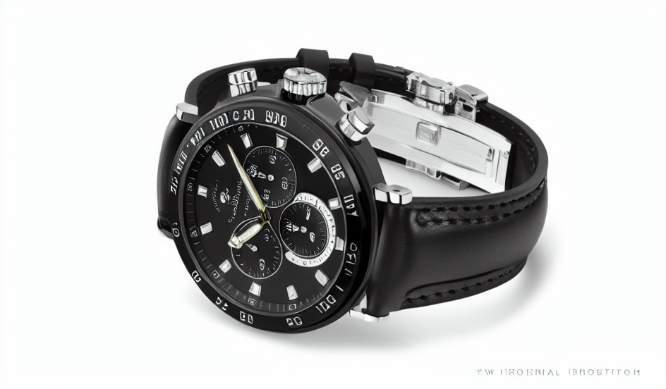
La montre reste très noire.

Run08 (strength=0.60) :
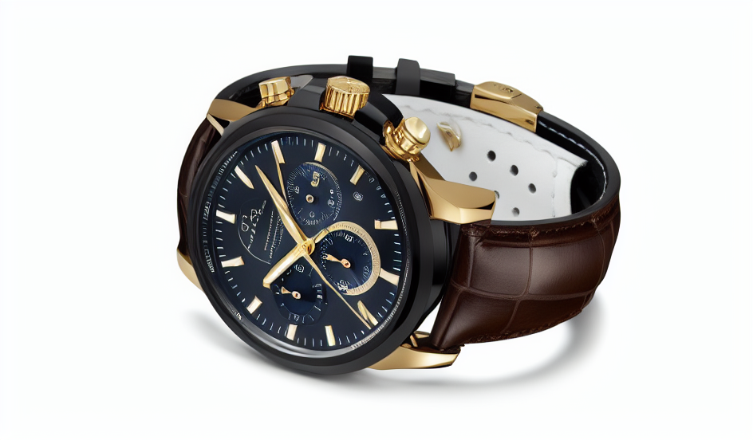
Le boîtier devient doré/bronze, le bracelet change un peu.

Run09 (strength=0.85) :
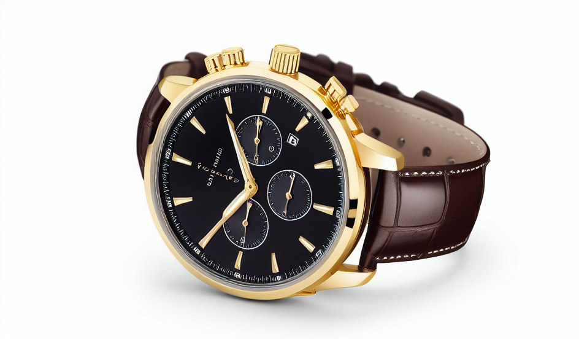
La montre est totalement or brillant avec un cuir marron clair, très différente.

Strength 0.35 (Modification faible) :
- Ce qui est conservé : La quasi-totalité de l'image. La géométrie, les reflets et surtout les couleurs originales (noir) dominent encore.
- Ce qui change : Très peu de choses. Le modèle "n'ose pas" appliquer le prompt (Or/Marron) car il est trop contraint par les pixels de départ.
- Bilan E-commerce : Inutile pour du restyling (changement de couleur/matière), car le produit ne change pas assez.

Strength 0.60 (Modification équilibrée) :
- Ce qui est conservé : L'identité du produit est là : la forme des cornes, la disposition des sous-cadrans et le fermoir sont reconnaissables.
- Ce qui change : La matière a changé avec succès. Le métal noir est devenu doré (aspect bronze) et le bracelet tire vers le marron foncé. L'éclairage s'adapte à la nouvelle réflectivité du métal.
- Bilan E-commerce : C'est le point d'équilibre. On obtient une variante réaliste du produit sans "mentir" sur sa forme physique.

Strength 0.85 (Modification forte) :
- Ce qui est conservé : Uniquement le concept global (une montre chronographe vue de 3/4).
- Ce qui change : Le modèle a pris trop de libertés. Le bracelet est devenu un cuir camel très clair, le cadran est simplifié, les aiguilles et les boutons poussoirs ont changé de design.
- Bilan E-commerce : Trop risqué. L'image est très belle et respecte parfaitement le prompt textuel, mais elle ne représente plus le produit physique réel. Cela s'apparente à une hallucination du modèle qui génère un nouveau produit au lieu de modifier l'existant.

**EXERCICE 5 : Mini-produit Streamlit (MVP) : Text2Img + Img2Img avec paramètres**

Text2Img : 
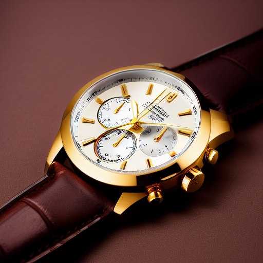

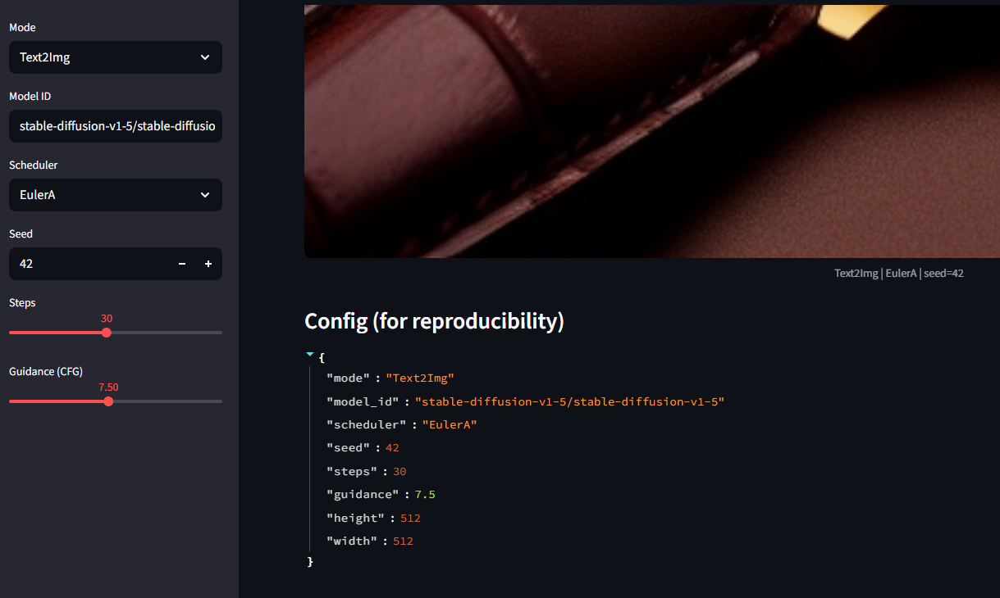

Img2Img :

On est reparti sur l'image de base de la montre et on a obtenu :

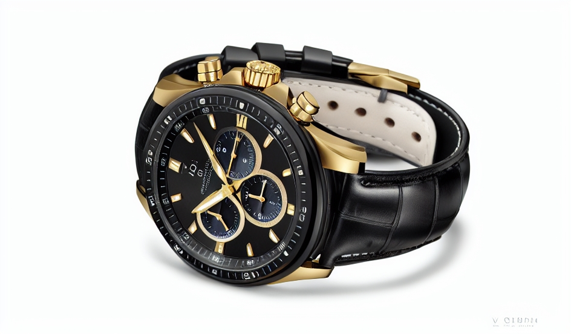

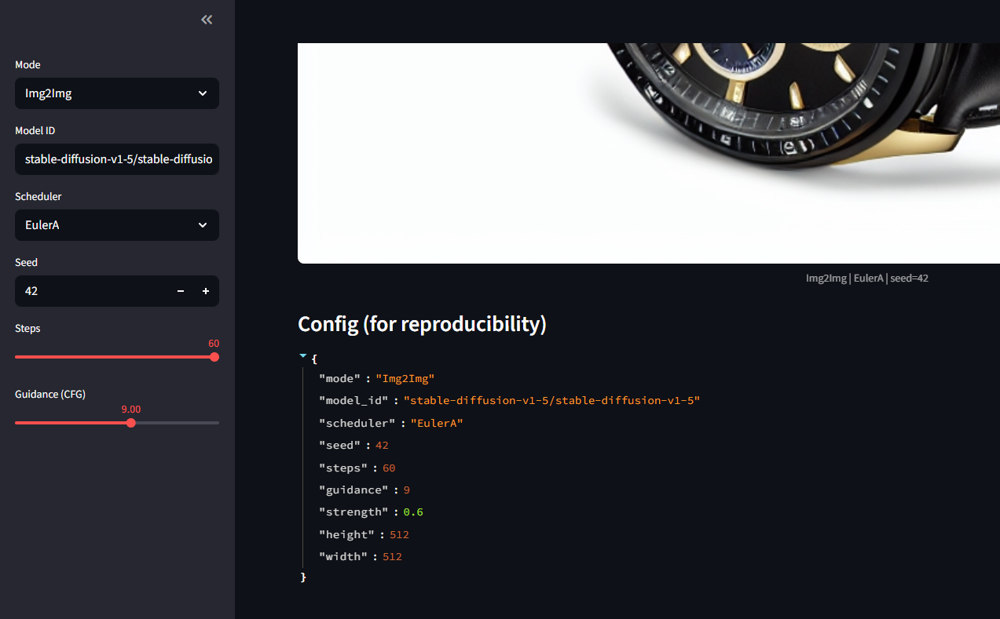

**EXERCICE 6 : Évaluation (léger) + réflexion (à finir à la maison)**

Question 6.b. Évaluez au moins 3 images parmi vos générations :
- une text2img baseline,
- une text2img avec un paramètre “extrême” (guidance haut ou steps bas/haut),
- une img2img à strength élevé.

Pour chacune : reportez les 5 scores (0–2), le total sur 10, et 2–3 bullets de justification.

Baseline Text2Img (Montre Or) :

- Prompt Adherence : 1/2 (Le prompt demandait un "black dial", le cadran généré est blanc/argenté. Le reste est bon).
- Visual Realism : 2/2 (L'éclairage studio et les reflets sur l'or sont excellents).
- Artifacts : 2/2 (Aucune déformation visible).
- E-commerce Usability : 2/2 (C'est une très belle photo produit générique).
- Reproducibility : 2/2.

TOTAL : 9/10

Text2Img "Extreme" (Basket - Guidance 12.0) :

- Prompt Adherence : 2/2 (Respect strict des mots clés "orange", "sneaker", "futuristic").
- Visual Realism : 1/2 (Le contraste est trop fort, l'image fait un peu "CGI" ou plastique à cause de la guidance trop élevée).
- Artifacts : 1/2 (Le grain de l'image est un peu "bruitée/cuit" typique d'un CFG élevé).
- E-commerce Usability : 1/2 (Un peu trop stylisé pour une fiche produit standard, mais ok pour une pub).
- Reproducibility : 2/2.

TOTAL : 7/10

Img2Img High Strength (Montre - Strength 0.85) :

- Prompt Adherence : 2/2 (La montre est bien devenue Or avec un bracelet cuir marron clair).
- Visual Realism : 2/2 (Très réaliste).
- Artifacts : 2/2 (Pas de défauts majeurs).
- E-commerce Usability : 0/2 (Sanction critique : Bien que l'image soit belle, ce n'est plus le même produit. La forme des aiguilles et du boîtier a changé. On ne peut pas vendre le produit A avec la photo du produit B).
- Reproducibility : 2/2.

TOTAL : 8/10

Question 6.c. Rédigez un paragraphe de réflexion (8–12 lignes) à la fin de rapport.md. Il doit obligatoirement couvrir les 3 points suivants :
- Le compromis quality vs latency/cost quand on ajuste steps/scheduler.
- La reproductibilité : quels paramètres sont nécessaires et ce qui peut casser.
- Les risques en e-commerce : hallucinations, images trompeuses, conformité (logos/texte), et ce que vous feriez pour limiter ces risques.

L'utilisation de la diffusion pour l'e-commerce présente un compromis constant entre Qualité et Coût/Latence : 
- augmenter le nombre d'étapes (Steps) au-delà de 30-40 avec un scheduler comme EulerA améliore peu la qualité visuelle mais augmente linéairement le temps de calcul (et donc le coût GPU).

La Reproductibilité est cruciale mais fragile : 
- il ne suffit pas de garder la seed, il faut impérativement versionner le scheduler, la précision et le matériel, car une différence minime d'implémentation peut changer le résultat final. 

Enfin, le risque majeur en e-commerce est l'hallucination produit : 
- générer une image trompeuse qui ne correspond pas aux caractéristiques physiques réelles de l'objet vendu. Pour limiter cela, il faut contraindre le modèle, utiliser des pipelines "Human-in-the-loop" pour la validation, et automatiser la détection de logos non conformes via des outils de vision classique.